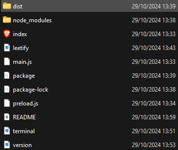

# Leetify app


## Requirements

- [NodeJS](https://nodejs.org) v20 or +

- [VisualStudioCode](https://code.visualstudio.com/)

## Installation

### Generate package


- For testing if you have NodeJS


```sh
npm i --save-dev electron
npm install electron-builder --save-dev
npm run build-win

```

### Use on Windows

1. You can found .exe in `dist/Leetify-win32-x64` 

2. Run `Leetify.exe` and enjoy!




- [Tuto](https://youtu.be/mkYQqbDhWbg)
